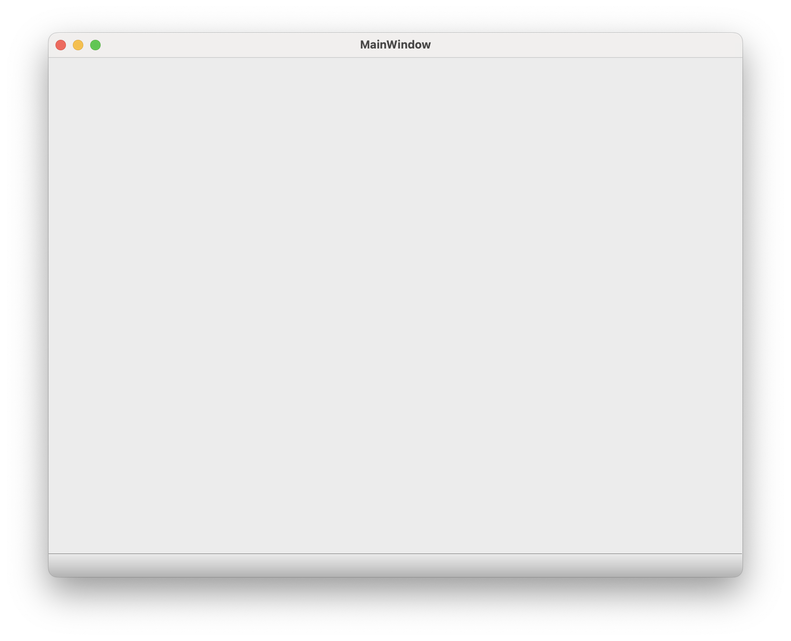

# Minimum Qt for Python Desktop Application Demo



**This is only for demonstrating and reference.**

## Usage

```
pdm run desktop-app
```

## Installation

Install with [pipx](https://pipx.pypa.io/stable/installation/)

```
pipx install git+https://github.com/mrjohannchang/minimum-qt-for-python-desktop-application-demo.git
```

## Development

### Design concepts

1. [Object-oriented programming](https://en.wikipedia.org/wiki/Object-oriented_programming)
2. [Model–view–viewmodel (MVVM)](https://en.wikipedia.org/wiki/Model%E2%80%93view%E2%80%93viewmodel)

### Environment

1. [Python 3.11+](https://www.python.org/)
2. [Qt for Python](https://doc.qt.io/qtforpython)
3. [PDM](https://pdm-project.org/)
4. [Git](https://git-scm.com/)

### Setup

```
pdm install
```

### Step by step reference

1. Create an empty project with [Git](https://git-scm.com/).

    ```
    git init
    ```

2. Initialize the Python project with [PDM](https://pdm-project.org/). I personally prefer the project to be based on [PEP 582 – Python local packages directory](https://peps.python.org/pep-0582/) instead of [PEP 405 – Python Virtual Environments](https://peps.python.org/pep-0405/).

    ```
    pdm init
    ```

3. Add [Qt for Python](https://doc.qt.io/qtforpython) as a dependent library.

    ```
    pdm add PySide6
    ```

4. Create a Main Window [Qt Designer UI file](https://doc.qt.io/qt-6/designer-ui-file-format.html) with [Qt Designer](https://doc.qt.io/qt-6/qtdesigner-manual.html).

    ```
    mkdir src/minimum_qt_for_python_desktop_application_demo_desktop
    touch src/minimum_qt_for_python_desktop_application_demo_desktop/__init__.py
    mkdir src/minimum_qt_for_python_desktop_application_demo_desktop/ui
    touch src/minimum_qt_for_python_desktop_application_demo_desktop/ui/__init__.py
    pdm run pyside6-designer
    ```

5. Create the desktop application entry point. If you chose [PEP 582 – Python local packages directory](https://peps.python.org/pep-0582/) for this project and plan to use PyCharm, at the time of writing, PyCharm does not support PEP 582 directly. Please manually set `__pypackages__/<major.minor>/lib` and `src` as [Sources Root](https://www.jetbrains.com/help/pycharm/configuring-project-structure.html#mark-dir-project-view).

    1. After configuring the script file in `pyproject.toml`, we need to install it:

        ```
        pdm install
        ```

    2. Then we will be able to run it:

        ```
        pdm run desktop-app
        ```

6. Add the logging function to the custom SDK.

7. Use custom `QMainWindow` class to add the window exit hook.

   **Note**: This is undocumented but IMHO the most authenticated way to do it.

## License

[Mozilla Public License Version 2.0](https://www.mozilla.org/en-US/MPL/2.0/)
